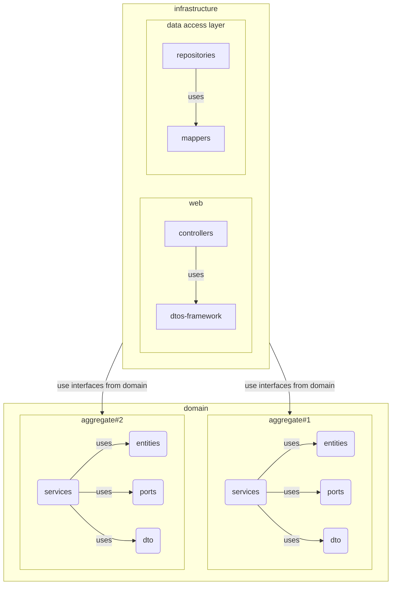
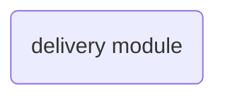

## Description

[Domain model](https://martinfowler.com/eaaCatalog/domainModel.html) with a clean architecture with ports and adapters. It takes into account some tactical patterns from DDD.



1. The system is divided into modules, each module is a separate piece of the system.



2. The module is divided into an infrastructure part and a domain part

```mermaid
  flowchart TD
    subgraph delivery-module(delivery-module)
	domain
	infrastucture
	end
```

3. Inside, the domain folder is divided into aggregates. Aggregates are a collection of entities. Each aggregate has a root. All interaction with entities must occur through the root.

## Installation

```bash
$ npm install
```

## Running the app

```bash
# development
$ npm run start

# watch mode
$ npm run start:dev

# production mode
$ npm run start:prod
```

## Test

```bash
# unit tests
$ npm run test

# e2e tests
$ npm run test:e2e

# test coverage
$ npm run test:cov
```
