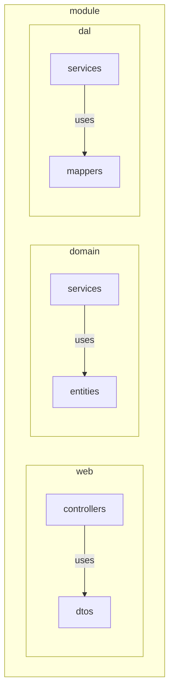

## Description

[Domain model](https://martinfowler.com/eaaCatalog/domainModel.html) with a clean architecture with ports and adapters. It takes into account some tactical patterns from DDD.



## Installation

```bash
$ npm install
```

## Running the app

```bash
# development
$ npm run start

# watch mode
$ npm run start:dev

# production mode
$ npm run start:prod
```

## Test

```bash
# unit tests
$ npm run test

# e2e tests
$ npm run test:e2e

# test coverage
$ npm run test:cov
```
