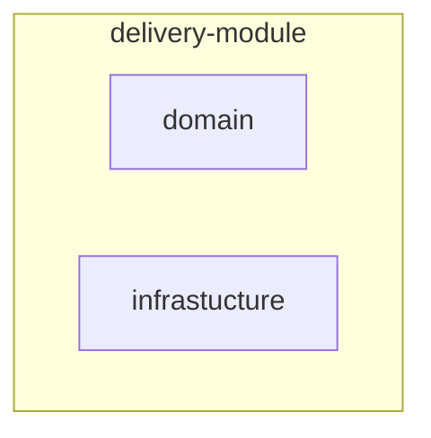
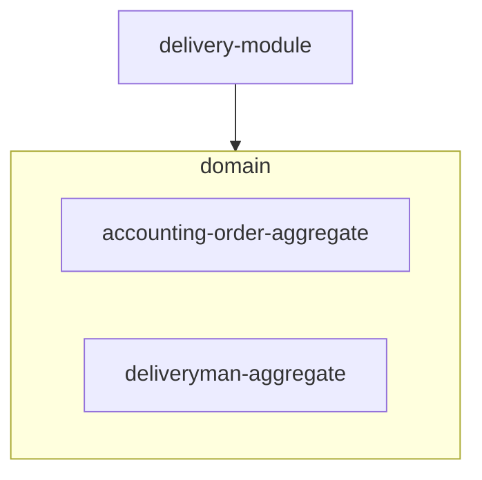
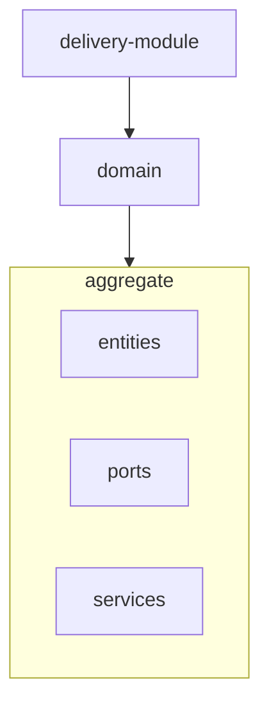
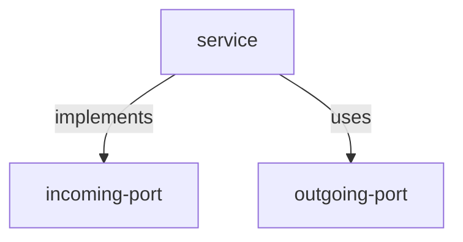
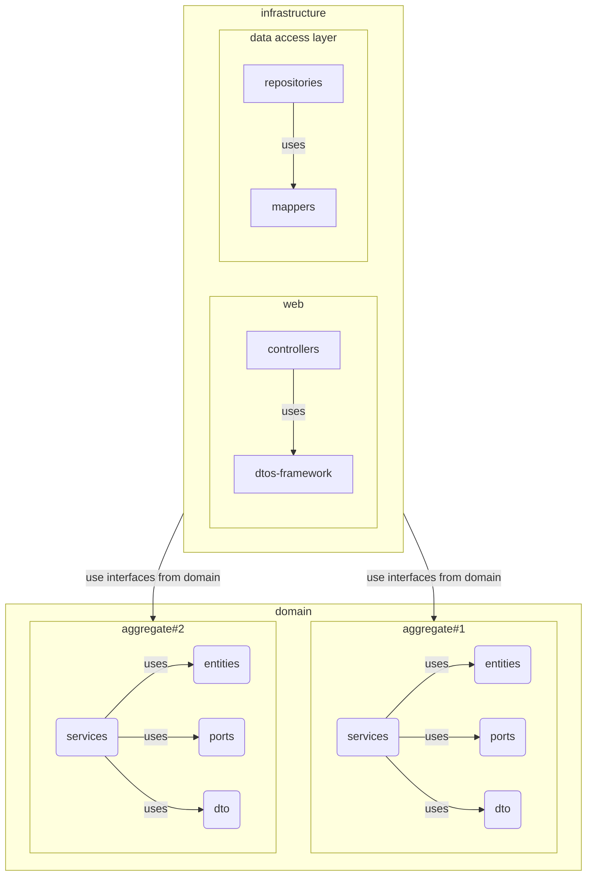

## Description

[Domain model](https://martinfowler.com/eaaCatalog/domainModel.html) with a clean architecture with ports and adapters. It takes into account some tactical patterns from DDD.

1. The system is divided into modules, each module is a separate piece of the system. The module is divided into an infrastructure part and a domain part



2. Inside, the domain folder is divided into aggregates. Aggregates are a collection of entities. Each aggregate has a root. All interaction with entities must occur through the root.



3. Each aggregate contains a set of entities with business logic, a set of value objects, a set of ports and services (use-cases)



4. Entities are models with business logic. In addition to the data, they must contain behavior. https://martinfowler.com/bliki/AnemicDomainModel.html
Value objects do not contain an Id and provide additional behavior. Entities(without id) within entities. https://martinfowler.com/bliki/ValueObject.html

5. Ports are interfaces. Incoming ports describe the services contract (application layer). The outgoing ports describe the data access layer contract.





## Installation

```bash
$ npm install
```

## Running the app

```bash
# development
$ npm run start

# watch mode
$ npm run start:dev

# production mode
$ npm run start:prod
```

## Test

```bash
# unit tests
$ npm run test

# e2e tests
$ npm run test:e2e

# test coverage
$ npm run test:cov
```
